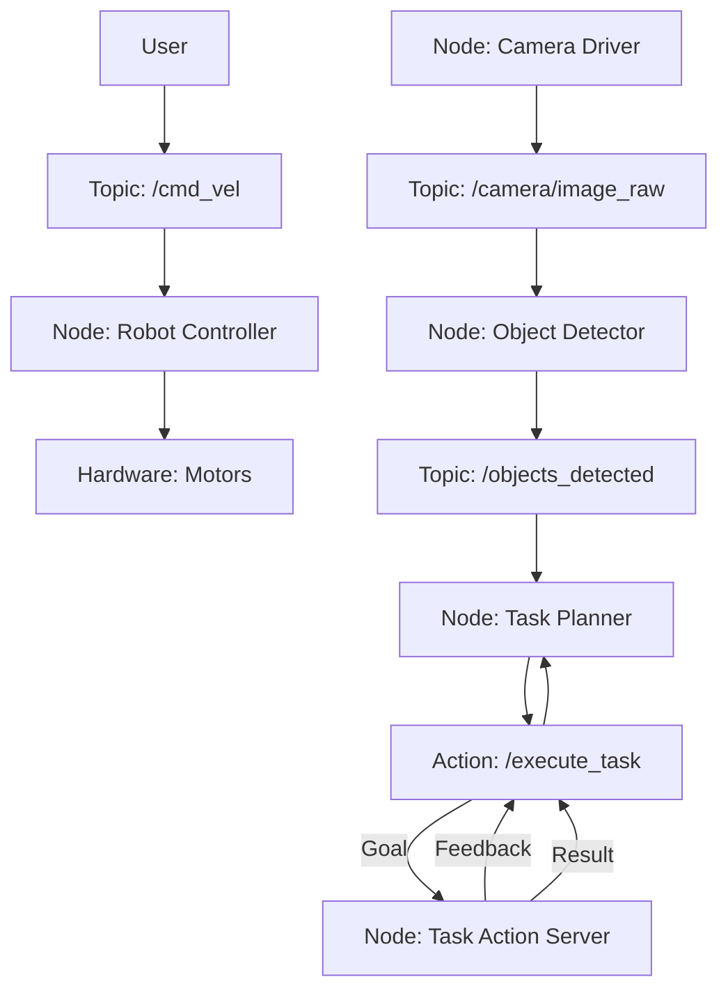

# ROS 2 Architecture

The Robot Operating System 2 (ROS 2) is a flexible framework for writing robot software. It's not an operating system in the traditional sense, but rather a set of software libraries, tools, and conventions that aim to simplify the task of creating complex and robust robot applications. Understanding its architecture is fundamental to developing any ROS 2-based system.

## Key Concepts

At its core, ROS 2 is designed around a distributed, peer-to-peer communication model. This means that individual components of a robot system (e.g., a camera driver, a navigation algorithm, a motor controller) can run independently and communicate with each other in a standardized way.

### Nodes

A **Node** is an executable process that performs computation. In ROS 2, every functional unit of a robot system is typically implemented as a node. For example:
*   A camera driver node that publishes image data.
*   A motion control node that subscribes to commands and publishes motor speeds.
*   A navigation node that computes paths.

Nodes communicate with each other using various mechanisms, the most common being:

### Topics

**Topics** are named buses over which nodes exchange messages. It's a publish/subscribe communication model.
*   A node can **publish** messages to a topic.
*   Other nodes can **subscribe** to a topic to receive those messages.
*   Messages sent on a topic do not have a specific destination; any node subscribed to that topic receives them. This allows for decoupled development.

### Services

**Services** are a request/reply communication model. They are used for synchronous, remote procedure calls (RPC).
*   A **service server** node provides a service and waits for requests.
*   A **service client** node sends a request to a service server and waits for a response.
*   Services are typically used for infrequent, explicit requests that require a response (e.g., "get current robot pose", "trigger emergency stop").

### Actions

**Actions** are a long-running, asynchronous request/reply communication model. They are similar to services but provide feedback and the ability to cancel the goal while it's being executed.
*   An **action server** provides an action, processes goals, sends feedback, and eventually a result.
*   An **action client** sends a goal to an action server and receives continuous feedback about the progress of the goal, and eventually a final result.
*   Actions are suitable for tasks that take a long time to complete and require continuous monitoring (e.g., "navigate to a point", "pick up an object").

## ROS 2 Graph

All these communication mechanisms form a **ROS 2 graph**, which is a network of nodes communicating with each other. Tools like `rqt_graph` allow you to visualize this graph, helping to understand the data flow in a complex robot system.

*Figure 3.1: Simplified ROS 2 Graph showing topics and actions.*

## ROS 2 Client Libraries

ROS 2 provides client libraries for various programming languages to interact with the ROS 2 system. The two most common are:
*   **`rclpy`**: The Python client library, which is high-level and easy to use, ideal for rapid prototyping and AI integration.
*   **`rclcpp`**: The C++ client library, offering higher performance and lower latency, suitable for real-time critical components.

Throughout this book, we will primarily use `rclpy` for developing robot software, especially when integrating with AI components.

## Data Types (Messages)

All data exchanged over topics, services, and actions is strongly typed using **messages**. ROS 2 provides a rich set of standard message types (`std_msgs`, `sensor_msgs`, `geometry_msgs`, etc.). You can also define your own custom message types to suit specific needs.

## Conclusion

Understanding the architectural components of ROS 2 – nodes, topics, services, and actions – is crucial for designing and implementing effective robot behaviors. In the next chapter, we will dive into practical examples of how to create and manage ROS 2 nodes using `rclpy`.
