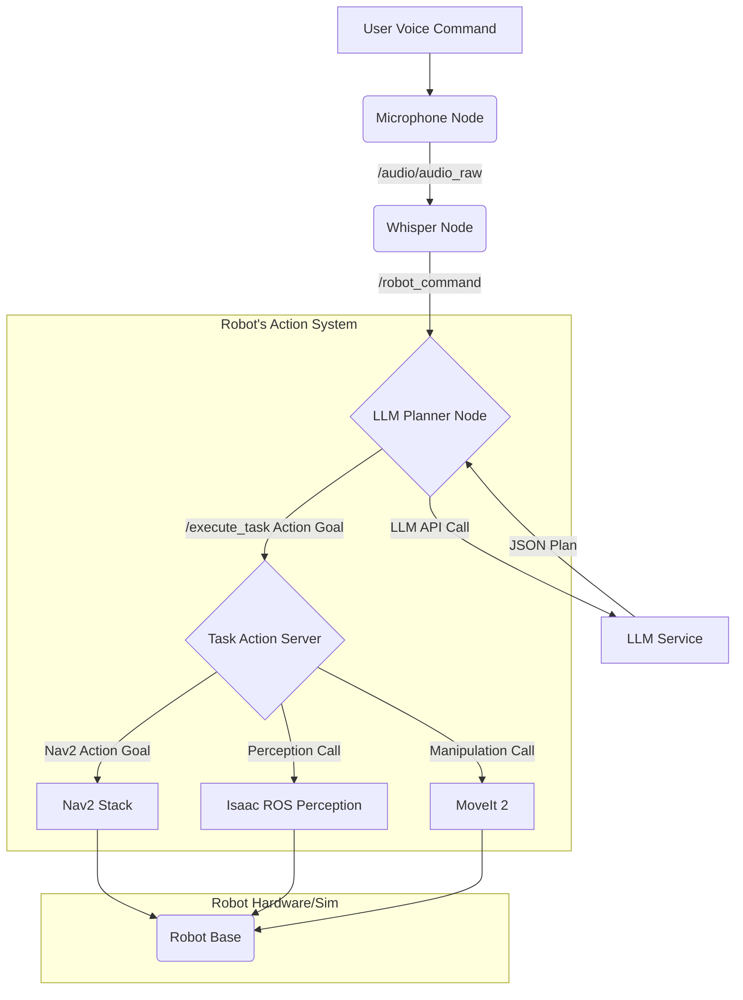

# Chapter 15: The Full VLA Pipeline

We have arrived at the culmination of the Vision-Language-Action module. In the previous chapters, we built the individual components: a "mouth" to hear commands (Whisper) and a "brain" to understand them (LLM Planner). Now, it's time to connect these parts to the robot's "body" and create a complete, end-to-end voice-controlled robotics system.

This chapter details how to integrate the Whisper node, the LLM Planner node, and an underlying `ExecuteTask` action server to bring our robot to life.

## The Complete VLA Architecture

Let's revisit the data flow for our full pipeline:

1.  **Voice Command**: A user speaks a command, e.g., "bring me the apple from the kitchen table."
2.  **Audio Capture**: A microphone node captures the audio and publishes it to the `/audio/audio_raw` topic.
3.  **Whisper Node**: Subscribes to `/audio/audio_raw`, transcribes the speech to text, and publishes the string "bring me the apple from the kitchen table" to the `/robot_command` topic.
4.  **LLM Planner Node**: Subscribes to `/robot_command`, receives the text, constructs a prompt, and sends it to an LLM.
5.  **LLM Response**: The LLM returns a JSON plan: `["navigate_to('kitchen_table')", "find_object('apple')", "pick_up_object()"]`.
6.  **Task Execution**: The LLM Planner Node parses the plan and sends the first goal, `navigate_to('kitchen_table')`, to the `/execute_task` action server.
7.  **Task Action Server**: This server receives the goal. Because the task is `navigate_to`, it makes a call to Nav2's action server, providing `kitchen_table` as the destination.
8.  **Navigation**: Nav2 executes the navigation, moving the robot to the table.
9.  **Feedback Loop**: The Task Action Server waits for Nav2 to succeed. Once it does, it returns a success result to the LLM Planner.
10. **Next Task**: The LLM Planner receives the success signal and sends the next goal in the plan, `find_object('apple')`, to the `/execute_task` server.
11. **Perception**: The Task Action Server receives the goal and invokes a perception routine (e.g., using Isaac ROS) to find the apple.
12. **Continue**: This process repeats until the entire plan is executed.



## The `ExecuteTask` Action Server

The missing piece is the `Task Action Server`. This is a critical node that acts as a bridge between the high-level commands from the LLM and the low-level ROS 2 systems like Nav2 and MoveIt 2.

Its job is to:
-   Receive a goal from the `/execute_task` action.
-   Examine the `task_name` (e.g., "navigate_to").
-   Based on the name, call the appropriate downstream service or action server.
-   Translate the generic parameters into the specific format required by the downstream system.
-   Monitor the downstream system and return a `success` or `failure` result to the LLM Planner.

## Bringing It All Up: The Master Launch File

To run the entire VLA system, we use a top-level launch file that starts all the necessary components in the correct order.

```python
# VLA Master Launch File Example

from launch import LaunchDescription
from launch_ros.actions import Node
from launch.actions import IncludeLaunchDescription
from launch.launch_description_sources import PythonLaunchDescriptionSource

def generate_launch_description():
    return LaunchDescription([
        # 1. Start the audio capture node
        Node(
            package='audio_common',
            executable='audio_capture',
            name='audio_capture_node',
            parameters=[{'device': 'hw:0,0'}] # Example device
        ),

        # 2. Start the Whisper transcription node
        Node(
            package='my_voice_control',
            executable='whisper_node',
            name='whisper_node',
            parameters=[{'model_size': 'small'}]
        ),
        
        # 3. Start the LLM Planner node
        Node(
            package='my_voice_control',
            executable='llm_planner_node',
            name='llm_planner_node'
        ),

        # 4. Start the Task Action Server
        Node(
            package='my_voice_control', # Assuming it's in the same package
            executable='task_action_server',
            name='task_action_server'
        ),

        # 5. Start Nav2 (using the launch file from Chapter 12)
        IncludeLaunchDescription(
            PythonLaunchDescriptionSource(
                'path/to/examples/ch12/nav2_bringup.launch.py'
            )
        )
    ])
```

## Example: Master Launch File

A master launch file that demonstrates how to launch all the components of the VLA pipeline together is available in the examples for this chapter. The README provides a complete overview of how to run the full system.

-   [**Chapter 15 Example: README**](/examples/ch15/README)
-   [**Chapter 15 Example: Launch File**](../../../examples/ch15/vla_pipeline.launch.py)

## Next Steps

This chapter has provided the blueprint for the complete VLA system. By integrating these nodes, you have created a robot that can be controlled with natural, high-level voice commands. The final phase of this book, the Capstone Project, will involve assembling all the code from every module into a single, cohesive, and impressive demonstration of a humanoid robot assistant.
