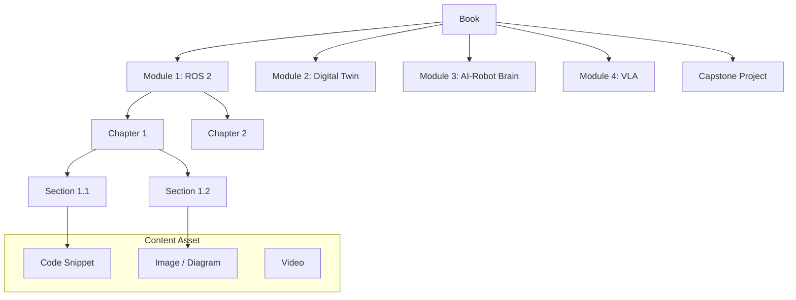

# Data Model: Physical AI & Humanoid Robotics Book

This document defines the high-level data model for the book's content structure. The model is hierarchical and primarily concerns the organization of Markdown/MDX files and associated assets.

## Entity Relationship Diagram

## Entity Descriptions

### Book
- **Description**: The top-level entity representing the entire "Physical AI & Humanoid Robotics Book". It is the root container for all content.
- **Attributes**:
  - `title`: string (e.g., "Physical AI & Humanoid Robotics")
  - `author`: string
  - `version`: string (e.g., "1.0.0")
- **Relationships**:
  - Has many `Modules`
  - Has one `Capstone Project`

### Module
- **Description**: A major thematic section of the book, corresponding to the core learning areas.
- **Attributes**:
  - `title`: string (e.g., "Module 1: The Robotic Nervous System (ROS 2)")
  - `order`: integer (1-4)
- **Relationships**:
  - Belongs to one `Book`
  - Has many `Chapters`

### Chapter
- **Description**: A specific, self-contained lesson within a Module.
- **Attributes**:
  - `title`: string (e.g., "Creating ROS 2 Nodes (rclpy)")
  - `order`: integer
- **Relationships**:
  - Belongs to one `Module`
  - Has many `Sections`

### Section
- **Description**: A subsection within a chapter that explains a particular concept or provides a step-by-step guide.
- **Attributes**:
  - `title`: string (e.g., "Understanding Publishers and Subscribers")
  - `order`: integer
- **Relationships**:
  - Belongs to one `Chapter`
  - Contains many `Content Assets`

### Content Asset
- **Description**: A generic entity representing a piece of content embedded within a section, such as a code snippet, diagram, image, or video.
- **Attributes**:
  - `type`: enum (CODE, IMAGE, DIAGRAM, VIDEO)
  - `source_path`: string (path to the asset file)
  - `caption`: string
- **Relationships**:
  - Belongs to one `Section`

## State Transitions
- N/A. This is a content model, and entities do not have state beyond their existence and content.

## Validation Rules
- `Book` must contain at least 4 `Modules` and 1 `Capstone Project`.
- `Module` `order` must be unique.
- `Chapter` `order` must be unique within a `Module`.
- All `Content Asset` `source_path` URIs must be valid and resolvable at build time.
