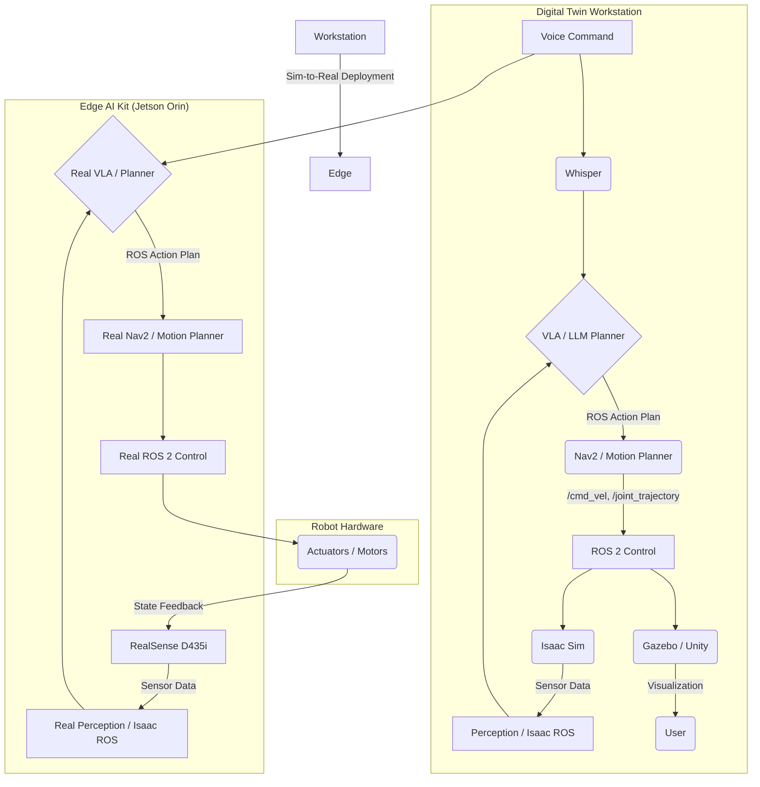

# Implementation Plan: Physical AI & Humanoid Robotics Book

**Branch**: `001-humanoid-robotics-book` | **Date**: 2025-12-06 | **Spec**: [spec.md](spec.md)
**Input**: Feature specification from `specs/001-humanoid-robotics-book/spec.md`

## Summary

This plan outlines the technical implementation for creating the "Physical AI & Humanoid Robotics Book," a comprehensive, hands-on guide for developers and students. The book is structured into four modules that take the reader from foundational robotics concepts in ROS 2 to advanced Vision-Language-Action (VLA) models. The project's goal is to produce a high-quality, reproducible, and beginner-friendly Docusaurus website that serves as a complete learning path for building and programming autonomous humanoid robots.

## Technical Context

**Language/Version**: Python 3.10+, C++17+ (for ROS 2 Humble)
**Primary Dependencies**: ROS 2 Humble, Gazebo (Ignition Fortress), NVIDIA Isaac Sim, Unity, Docusaurus, Whisper, PyTorch
**Storage**: Git (for version control), local Markdown/MDX files for content.
**Testing**: `colcon test` (ROS 2), `pytest` (Python), manual end-to-end validation of examples.
**Target Platform**: Ubuntu 22.04 (Workstation), NVIDIA Jetson Orin (Edge Device).
**Project Type**: Documentation (Book with Code Examples).
**Performance Goals**: N/A (Focus is on reproducibility and clarity, not runtime performance benchmarks).
**Constraints**: All examples must run on specified hardware (RTX 4070 Ti, Jetson Orin, RealSense D435i). No deprecated technologies (e.g., ROS 1). All diagrams must be original.
**Scale/Scope**: 8-12 chapters, 12,000–18,000 words.

## Constitution Check

*GATE: Must pass before Phase 0 research. Re-check after Phase 1 design.*

- [x] **Spec-Driven Authorship**: This plan is derived directly from an approved spec.
- [x] **Technical Accuracy**: The technologies chosen are current and will be validated.
- [x] **Clarity**: The plan is structured for clarity, targeting the book's audience.
- [x] **Modularity & Reusability**: The book structure is modular by design (4 modules).
- [x] **AI-Assisted Workflow Integrity**: This plan adheres to the Spec-Kit Plus methodology.
- [x] **Standardized Structure**: The project will use the Docusaurus and ROS 2 package standards.
- [x] **Tooling Standardization**: All tools are explicitly defined and verifiable.
- [x] **High-Quality Writing**: The plan enforces quality checks for the book's content.
- [x] **Primary Source Citation**: The research phase will require citation.
- [x] **Zero Fluff**: The plan is focused on practical implementation.
- [x] **Project Constraints**: The plan respects all defined project constraints.

## Architecture Sketch

The project's architecture integrates several key systems across two main hardware platforms: a "Digital Twin Workstation" for development and simulation, and an "Edge AI Kit" (NVIDIA Jetson Orin) for real-world deployment.

**Data Flow:**

1.  **Sensing (Real & Sim)**: In simulation (Gazebo/Isaac), virtual sensors (LiDAR, IMU, cameras) generate data. In the real world (Robot Lab), the RealSense D435i camera provides vision data.
2.  **Perception (Isaac)**: Sensor data is fed into the AI brain running on the workstation or Jetson. NVIDIA Isaac ROS GEMs (VSLAM, AprilTags, etc.) process this data to understand the environment.
3.  **Planning (VLA & Nav2)**: A high-level LLM converts voice commands (from Whisper) into a sequence of tasks (VLA). For navigation, Nav2 computes a path.
4.  **Control (ROS 2)**: The plan is sent as ROS 2 messages (topics/actions) to low-level controllers.
5.  **Actuation (Robot)**: The controllers convert ROS 2 messages into joint commands for the robot's motors (simulated or real).

## Book Section Structure (High-Level Outline)

**Phase 1 — Research** (Concurrent with each chapter)
- Each chapter begins with research on the specific tools and techniques to be discussed, with all claims cited using APA style.

**Phase 2 — Foundation (Setup & Core Concepts)**
- **Chapter 1: Introduction to Physical AI**: Defines the field and outlines the book's goals.
- **Chapter 2: Setting Up Your Lab**: A detailed guide to setting up the Digital Twin Workstation (Ubuntu 22.04, NVIDIA drivers, ROS 2, etc.) and the Edge AI Kit (Jetson Orin).

**Phase 3 — Analysis (The Four Modules)**
- **Module 1: The Robotic Nervous System (ROS 2)**
  - Chapter 3: ROS 2 Architecture
  - Chapter 4: Creating ROS 2 Nodes (rclpy)
  - Chapter 5: Topics, Services, and Actions
  - Chapter 6: Describing the Robot (URDF/SDF)
- **Module 2: The Digital Twin (Gazebo & Unity)**
  - Chapter 7: Building Simulation Worlds (Gazebo)
  - Chapter 8: Advanced Visualization (Unity)
  - Chapter 9: Simulating Sensors and Physics
- **Module 3: The AI-Robot Brain (NVIDIA Isaac)**
  - Chapter 10: Isaac Sim for Photorealistic Simulation
  - Chapter 11: Perception with Isaac ROS (VSLAM, AprilTags)
  - Chapter 12: Navigation with Nav2
- **Module 4: Vision-Language-Action (VLA)**
  - Chapter 13: Voice Control with Whisper
  - Chapter 14: LLM-based Planning
  - Chapter 15: The Full VLA Pipeline

**Phase 4 — Synthesis (Capstone Project)**
- **Chapter 16: Capstone Project - Autonomous Humanoid Assistant**: Integrates all modules into a final project where the robot takes voice commands and performs tasks in simulation, with a guide for sim-to-real transfer.

## Quality Validation

- **Module-level Checks**:
  - **ROS 2**: `colcon test` passes; `ros2 node list`, `ros2 topic list` match expected graphs.
  - **Gazebo**: Simulation loads without physics errors; robot model is stable.
  - **Isaac**: Perception pipeline correctly identifies objects/tags; Nav2 successfully navigates a test world.
  - **VLA**: A set of 10 test commands are correctly converted to ROS 2 action plans.
- **Book-level Checks**:
  - **Accuracy & Reproducibility**: Every command is tested against the specified hardware/software.
  - **Clarity**: Content adheres to Flesch Reading Ease score of 50-60.
  - **Citations**: APA citation style is enforced for all external claims.
  - **Safety**: LLM-based control includes documented safety constraints.

## Testing Strategy

- **Unit Tests**: Python code within ROS 2 nodes will be tested with `pytest`.
- **Integration Tests**:
  - **ROS 2**: Test message passing between nodes for each module.
  - **Gazebo/Isaac**: Verify that the simulated robot responds correctly to control commands.
  - **VLA**: End-to-end tests where a natural language command is given and the final robot action is verified.
- **Capstone Test**: A final test scenario will be defined for the capstone project, e.g., "User says 'bring me the red block from the other table'." The robot must successfully perceive the block, navigate to it, simulate picking it up, and return. This will be validated in simulation.